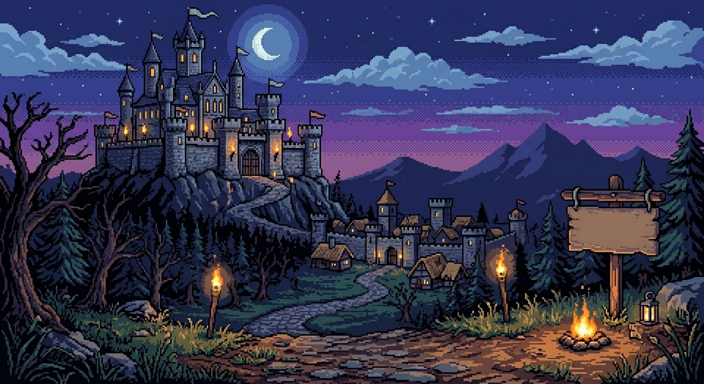

# Astral Swarm

> **Sobrevive al enjambre.** — *v1.0.0*

Astral Swarm es un juego de acción y supervivencia *(estilo "survivor")* en pixel art:
eliges un héroe, sobrevives a oleadas crecientes de enemigos, recoges gemas de
experiencia y oro, subes de nivel y mejoras tu equipo.

Hecho con **Unity 6 (6000.3.16f1)** y UI Toolkit.



---

## ✨ Características

- **Menú principal en UI Toolkit** con 3 temas visuales (Forged, Astral, Grimoire) y
  ambiente animado: luces dinámicas (luna, antorchas, hoguera, farol) con parpadeo.
- **Selección de héroe**: 3 clases (Guerrero, Arquero, Lancero) y 5 colores.
- **Gameplay survivor**: combate automático, oleadas de enemigos, drops de gemas y oro,
  subida de nivel y selección de mejoras.
- **Terreno TinySwords** con césped infinito alrededor del jugador.
- **Ajustes** (en menú y en partida): modo de pantalla, **resolución** (se aplica y se
  guarda entre sesiones) y volumen (general / música / efectos).
- **Audio**: música de menú y bucle de música in-game, además de un **tema de menú épico
  generado por código** (orquestal/chiptune sintetizado) seleccionable.

## 🎮 Controles

| Acción | Tecla |
|--------|-------|
| Moverse | `W A S D` o flechas |
| Atacar | Automático |
| Pausa / Ajustes | botón en el HUD |
| Cancelar / volver | `Esc` |

## 🎵 Audio

La música de menú se resuelve por prioridad en `AudioManager`:

1. **Pista en una carpeta `Resources`** cuyo nombre se indique en
   `Menu Music Resource Name` (por defecto `berserk-guts`). Tiene prioridad.
2. **Tema épico generado por código** (`EpicMenuMusic`) si `Use Procedural Menu Music`
   está activo.
3. La música asignada en el Inspector (`mainMenuMusic`).

Para cambiar de pista: suelta un `.ogg`/`.mp3`/`.wav` en cualquier carpeta `Resources` y
pon su nombre (sin extensión) en ese campo; vacíalo para usar el tema generado o el del
Inspector.

---

## 🕹️ Cómo jugar (build de Windows)

1. Descarga `AstralSwarm-Win64.zip`.
2. Descomprímelo **entero** (el `.exe` necesita la carpeta `Astral Swarm_Data` y los
   `.dll` al lado).
3. Ejecuta **`Astral Swarm.exe`**.

## 🔧 Compilar desde el código

Requiere **Unity 6000.3.16f1** con *Windows Build Support* (para `.exe`) y/o
*WebGL Build Support* (para navegador).

Escenas en *Build Settings* (en orden): `MainMenu` → `SampleScene` → `Game`.
El juego arranca siempre en **MainMenu**.

### Builds

- **Windows `.exe`**: menú `Astral Swarm > Build Windows (.exe)`
  (o por consola: `Unity.exe -batchmode -projectPath . -executeMethod BuildWindows.Build -quit`).
  Salida en `Builds/AstralSwarm-Win64/`.
- **Icono del ejecutable**: `Astral Swarm > Set App Icon` (usa `Assets/Icon/AppIcon.png`).

### Montaje de escenas (menús de editor)

| Escena | Paso | Menú |
|--------|------|------|
| MainMenu | Montar menú UITK | `Tools > Astral Swarm > Montar Menú (UI Toolkit)` |
| Game | 1. Gameplay | `Astral Swarm > Setup Game Scene` |
| Game | 2. Sprites/Animator | `Astral Swarm > Configure Sprites and Animator` |
| Game | 3. HUD | `Astral Swarm > Setup HUD (UI Toolkit)` |
| Game | 4. Mundo (opcional) | `Astral Swarm > Reconstruir Mundo (terreno + warrior)` |

---

## 📁 Estructura (resumen)

```
Assets/
├─ Scenes/            MainMenu, Game, SampleScene
├─ Scripts/           AudioManager, PlayerController, GameManager, EpicMenuMusic…
├─ UI/MainMenu/       menú UITK (UXML/USS, MainMenuController)
├─ UI/HUD/            HUD in-game (HUDController)
├─ Sonidos/           música y efectos
├─ Fonts/             tipografías (UnifrakturCook para el título)
├─ Icon/              AppIcon.png (icono del .exe)
└─ Editor/            scripts de setup y build
```

## 📜 Créditos / assets

- Arte de unidades y terreno: **TinySwords**.
- Iconos: *Shikashi*, *TravelBook Lite*.
- Tipografías: UnifrakturCook, Pirata One, Pixelify Sans, Jersey 25, Silkscreen, Jacquard 12.

---

*Astral Swarm — v1.0.0.*
